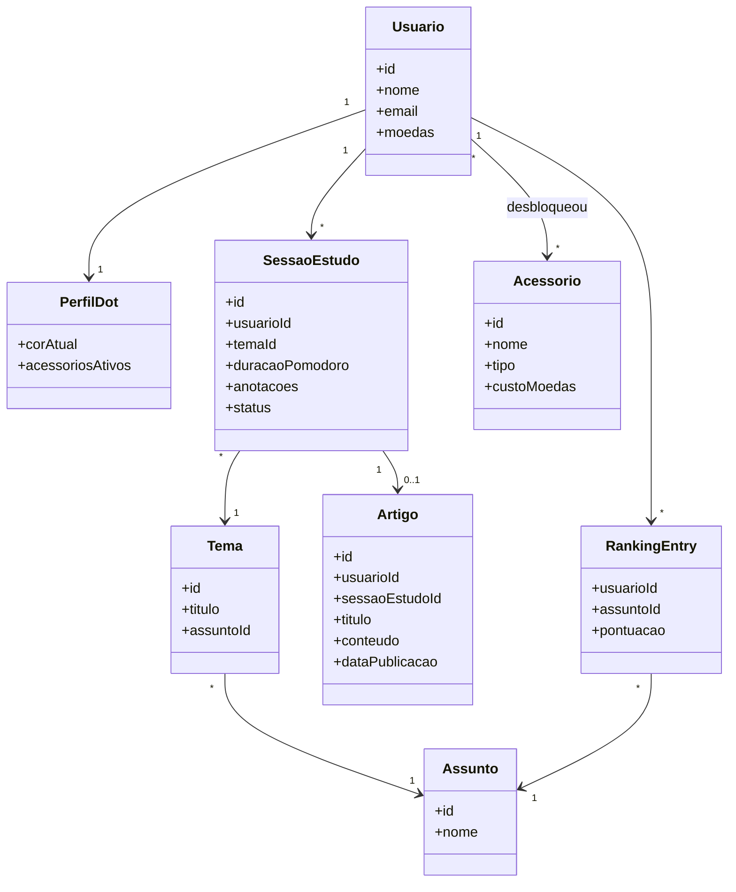
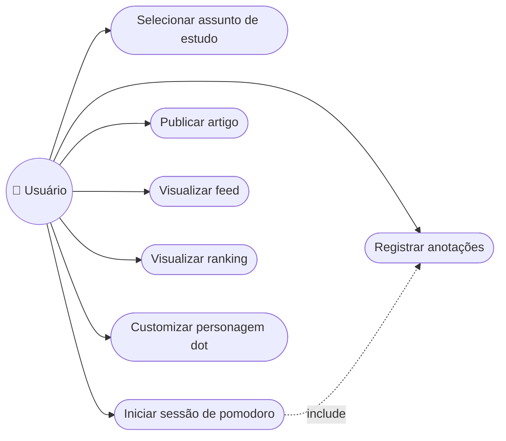

# Modelagem UML

Diagramas em Mermaid, renderizados diretamente no GitHub (sem depender de ferramenta externa).

## Diagrama de Classes

## Diagrama de Caso de Uso

Mermaid não tem um tipo nativo para diagrama de caso de uso; representado como `flowchart` seguindo a convenção ator → elipses de caso de uso.

