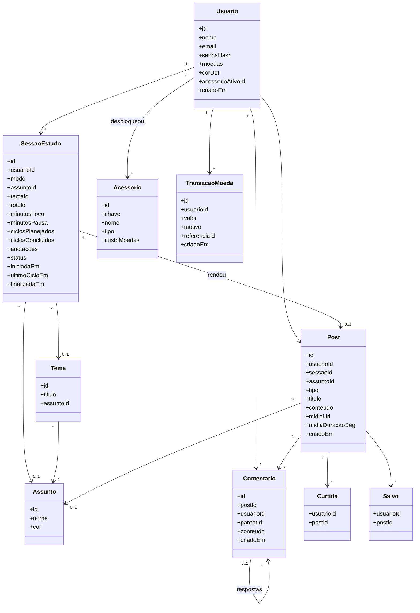
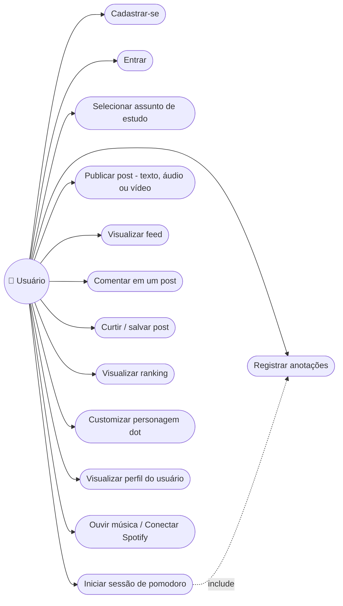
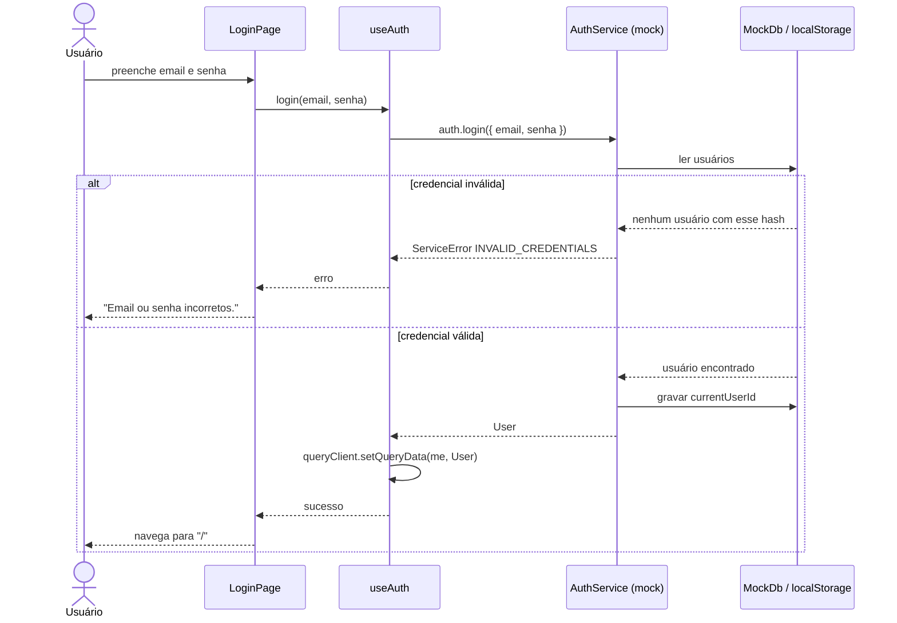
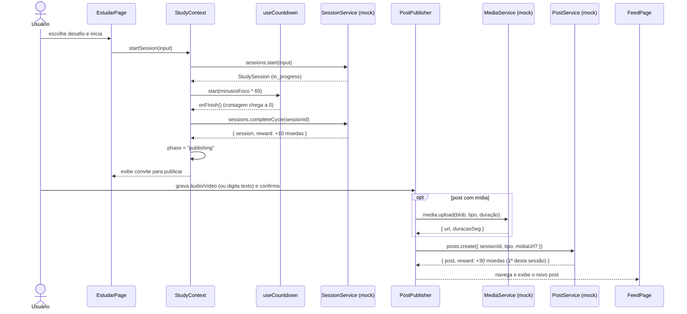
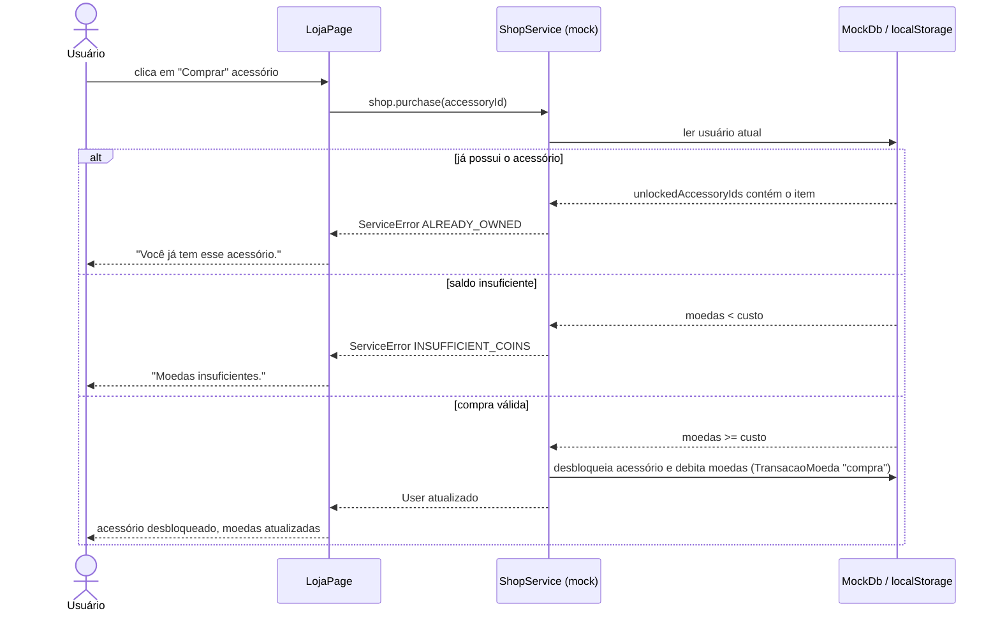
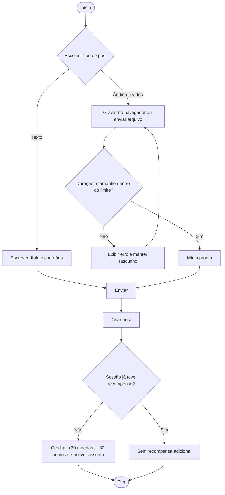

# Modelagem UML

Diagramas em Mermaid, renderizados diretamente no GitHub (sem depender de ferramenta externa). Os diagramas de classes e casos de uso foram atualizados para o modelo do CP5 (`docs/superpowers/specs/2026-09-29-dot-study-cp5-cp6-design.md`, seção 4); os diagramas de sequência e de atividade são novos neste checkpoint e descrevem o comportamento real do código em `frontend/src/`.

## Diagrama de Classes

```mermaid
classDiagram
    class Usuario {
        +id
        +nome
        +email
        +senhaHash
        +moedas
        +corDot
        +acessorioAtivoId
        +criadoEm
    }
    class Assunto {
        +id
        +nome
        +cor
    }
    class Tema {
        +id
        +titulo
        +assuntoId
    }
    class SessaoEstudo {
        +id
        +usuarioId
        +modo
        +assuntoId
        +temaId
        +rotulo
        +minutosFoco
        +minutosPausa
        +ciclosPlanejados
        +ciclosConcluidos
        +anotacoes
        +status
        +iniciadaEm
        +ultimoCicloEm
        +finalizadaEm
    }
    class Post {
        +id
        +usuarioId
        +sessaoId
        +assuntoId
        +tipo
        +titulo
        +conteudo
        +midiaUrl
        +midiaDuracaoSeg
        +criadoEm
    }
    class Comentario {
        +id
        +postId
        +usuarioId
        +parentId
        +conteudo
        +criadoEm
    }
    class Curtida {
        +usuarioId
        +postId
    }
    class Salvo {
        +usuarioId
        +postId
    }
    class Acessorio {
        +id
        +chave
        +nome
        +tipo
        +custoMoedas
    }
    class TransacaoMoeda {
        +id
        +usuarioId
        +valor
        +motivo
        +referenciaId
        +criadoEm
    }

    Usuario "1" --> "*" SessaoEstudo
    Usuario "1" --> "*" Post
    Usuario "1" --> "*" Comentario
    Usuario "1" --> "*" TransacaoMoeda
    Usuario "*" --> "*" Acessorio : desbloqueou
    SessaoEstudo "1" --> "0..1" Post : rendeu
    SessaoEstudo "*" --> "0..1" Tema
    SessaoEstudo "*" --> "0..1" Assunto
    Tema "*" --> "1" Assunto
    Post "*" --> "0..1" Assunto
    Post "1" --> "*" Comentario
    Post "1" --> "*" Curtida
    Post "1" --> "*" Salvo
    Comentario "0..1" --> "*" Comentario : respostas
```

> **Notas sobre as mudanças em relação ao CP4** (detalhadas em `docs/08-jornada.md`): `PerfilDot` foi incorporado ao `Usuario` (`corDot` + `acessorioAtivoId`); `Artigo` virou `Post`, com campo `tipo` (`texto`/`audio`/`video`) e campos de mídia; `Comentario` ganhou `parentId` para permitir respostas; `Curtida` e `Salvo` são novas entidades de chave composta (usuário + post); `TransacaoMoeda` registra cada crédito/débito de moeda (motivo: boas-vindas, ciclo, post ou compra). **`RankingEntry` deixou de ser uma classe/tabela**: o ranking é calculado por consulta sobre `SessaoEstudo` e `Post` (ver `computeSubjectScores` em `frontend/src/domain/rules.ts`), evitando dado duplicado.

## Diagrama de Caso de Uso

Mermaid não tem um tipo nativo para diagrama de caso de uso; representado como `flowchart` seguindo a convenção ator → elipses de caso de uso.

```mermaid
flowchart LR
    Usuario(("👤 Usuário"))
    UC0a([Cadastrar-se])
    UC0b([Entrar])
    UC1([Selecionar assunto de estudo])
    UC2([Iniciar sessão de pomodoro])
    UC3([Registrar anotações])
    UC4([Publicar post - texto, áudio ou vídeo])
    UC5([Visualizar feed])
    UC5b([Comentar em um post])
    UC5c([Curtir / salvar post])
    UC6([Visualizar ranking])
    UC7([Customizar personagem dot])
    UC8([Visualizar perfil do usuário])
    UC9([Ouvir música / Conectar Spotify])

    Usuario --> UC0a
    Usuario --> UC0b
    Usuario --> UC1
    Usuario --> UC2
    Usuario --> UC3
    Usuario --> UC4
    Usuario --> UC5
    Usuario --> UC5b
    Usuario --> UC5c
    Usuario --> UC6
    Usuario --> UC7
    Usuario --> UC8
    Usuario --> UC9
    UC2 -. include .-> UC3
```

## Diagrama de Sequência — Login

Representa `frontend/src/pages/LoginPage.tsx` chamando `useAuth` (`frontend/src/hooks/useAuth.ts`), que delega ao `AuthService` mockado (`frontend/src/services/mock/auth.ts`), lido/gravado no `MockDb` sobre `localStorage`.

```mermaid
sequenceDiagram
    actor U as Usuário
    participant LP as LoginPage
    participant Auth as useAuth
    participant Svc as AuthService (mock)
    participant DB as MockDb / localStorage

    U ->> LP: preenche email e senha
    LP ->> Auth: login(email, senha)
    Auth ->> Svc: auth.login({ email, senha })
    Svc ->> DB: ler usuários
    alt credencial inválida
        DB -->> Svc: nenhum usuário com esse hash
        Svc -->> Auth: ServiceError INVALID_CREDENTIALS
        Auth -->> LP: erro
        LP -->> U: "Email ou senha incorretos."
    else credencial válida
        DB -->> Svc: usuário encontrado
        Svc ->> DB: gravar currentUserId
        Svc -->> Auth: User
        Auth ->> Auth: queryClient.setQueryData(me, User)
        Auth -->> LP: sucesso
        LP -->> U: navega para "/"
    end
```

## Diagrama de Sequência — Sessão de estudo até publicação

Representa `frontend/src/pages/EstudarPage.tsx` e `frontend/src/content/StudyContext.tsx` (contador em `frontend/src/hooks/useCountdown.ts`), a conclusão de ciclo em `frontend/src/services/mock/sessions.ts`, e a publicação via `frontend/src/components/PostPublisher.tsx` (upload em `frontend/src/services/mock/media.ts`, criação do post em `frontend/src/services/mock/posts.ts`).

```mermaid
sequenceDiagram
    actor U as Usuário
    participant EP as EstudarPage
    participant SC as StudyContext
    participant CD as useCountdown
    participant SSvc as SessionService (mock)
    participant PP as PostPublisher
    participant MSvc as MediaService (mock)
    participant PSvc as PostService (mock)
    participant Feed as FeedPage

    U ->> EP: escolhe desafio e inicia
    EP ->> SC: startSession(input)
    SC ->> SSvc: sessions.start(input)
    SSvc -->> SC: StudySession (in_progress)
    SC ->> CD: start(minutosFoco * 60)
    CD -->> SC: onFinish() (contagem chega a 0)
    SC ->> SSvc: sessions.completeCycle(sessionId)
    SSvc -->> SC: { session, reward: +10 moedas }
    SC ->> SC: phase = "publishing"
    SC -->> EP: exibe convite para publicar
    U ->> PP: grava áudio/vídeo (ou digita texto) e confirma
    opt post com mídia
        PP ->> MSvc: media.upload(blob, tipo, duração)
        MSvc -->> PP: { url, duracaoSeg }
    end
    PP ->> PSvc: posts.create({ sessionId, tipo, midiaUrl? })
    PSvc -->> PP: { post, reward: +30 moedas (1ª desta sessão) }
    PP -->> Feed: navega e exibe o novo post
```

## Diagrama de Sequência — Compra na loja

Representa `frontend/src/pages/LojaPage.tsx` chamando `ShopService.purchase` (`frontend/src/services/mock/shop.ts`).

```mermaid
sequenceDiagram
    actor U as Usuário
    participant LJ as LojaPage
    participant Svc as ShopService (mock)
    participant DB as MockDb / localStorage

    U ->> LJ: clica em "Comprar" acessório
    LJ ->> Svc: shop.purchase(accessoryId)
    Svc ->> DB: ler usuário atual
    alt já possui o acessório
        DB -->> Svc: unlockedAccessoryIds contém o item
        Svc -->> LJ: ServiceError ALREADY_OWNED
        LJ -->> U: "Você já tem esse acessório."
    else saldo insuficiente
        DB -->> Svc: moedas < custo
        Svc -->> LJ: ServiceError INSUFFICIENT_COINS
        LJ -->> U: "Moedas insuficientes."
    else compra válida
        DB -->> Svc: moedas >= custo
        Svc ->> DB: desbloqueia acessório e debita moedas (TransacaoMoeda "compra")
        Svc -->> LJ: User atualizado
        LJ -->> U: acessório desbloqueado, moedas atualizadas
    end
```

## Diagrama de Atividade — Fluxo de estudo

Representa o fluxo controlado por `frontend/src/content/StudyContext.tsx` em `frontend/src/pages/EstudarPage.tsx`: escolha do modo, ciclos de foco/pausa via `useCountdown`, e o desfecho (publicar no modo desafio, resumo no modo livre).

```mermaid
flowchart TD
    A([Início]) --> B{Escolher modo}
    B -->|Desafio| C[Escolher dificuldade e assunto ou aleatório]
    C --> D[Sortear tema do assunto]
    D --> E[Ciclo de foco]
    B -->|Livre| F[Definir rótulo, foco, pausa e nº de ciclos]
    F --> G[Ciclo de foco]
    E --> H{Ciclo concluído?}
    G --> H2{Ciclo concluído?}
    H -->|Sim, desafio| I[Publicar post ou pular]
    H2 -->|Sim, ainda há ciclos| J[Pausa]
    J --> G
    H2 -->|Sim, último ciclo| K[Resumo da sessão]
    I --> L([Fim])
    K --> L
```

## Diagrama de Atividade — Publicação

Representa `frontend/src/components/PostPublisher.tsx`: escolha do tipo de post, gravação/envio de mídia (áudio ou vídeo, via `frontend/src/hooks/useMediaRecorder.ts`), validação de limites e a recompensa condicional.

```mermaid
flowchart TD
    A([Início]) --> B{Escolher tipo de post}
    B -->|Texto| C[Escrever título e conteúdo]
    B -->|Áudio ou vídeo| D[Gravar no navegador ou enviar arquivo]
    D --> E{Duração e tamanho dentro do limite?}
    E -->|Não| F[Exibir erro e manter rascunho]
    F --> D
    E -->|Sim| G[Mídia pronta]
    C --> H[Enviar]
    G --> H
    H --> I[Criar post]
    I --> J{Sessão já teve recompensa?}
    J -->|Não| K[Creditar +30 moedas / +30 pontos se houver assunto]
    J -->|Sim| L[Sem recompensa adicional]
    K --> M([Fim])
    L --> M
```
