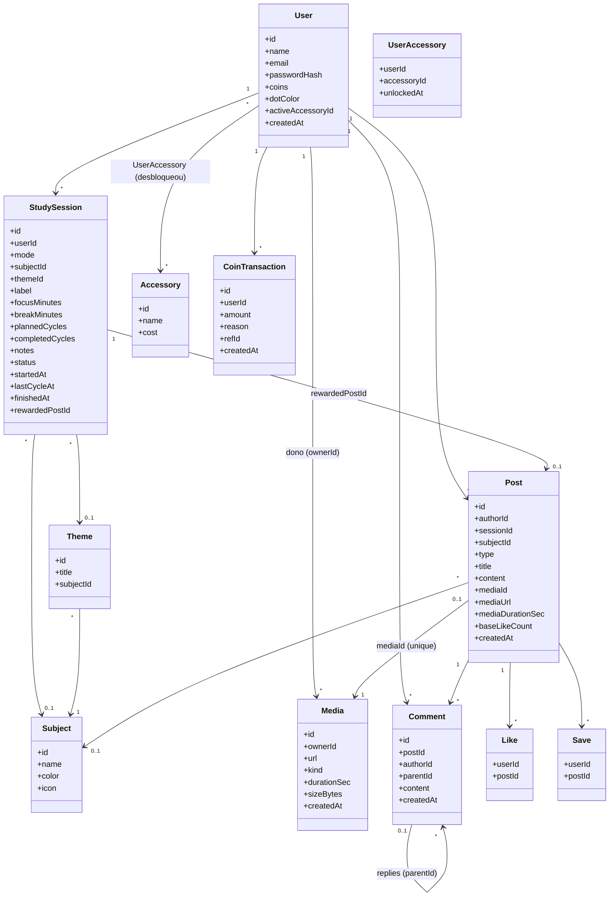
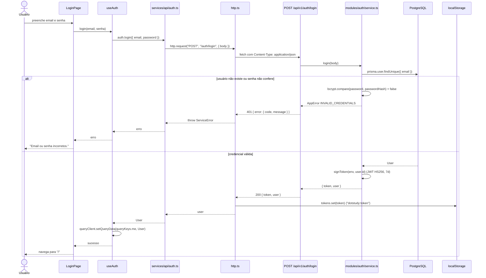
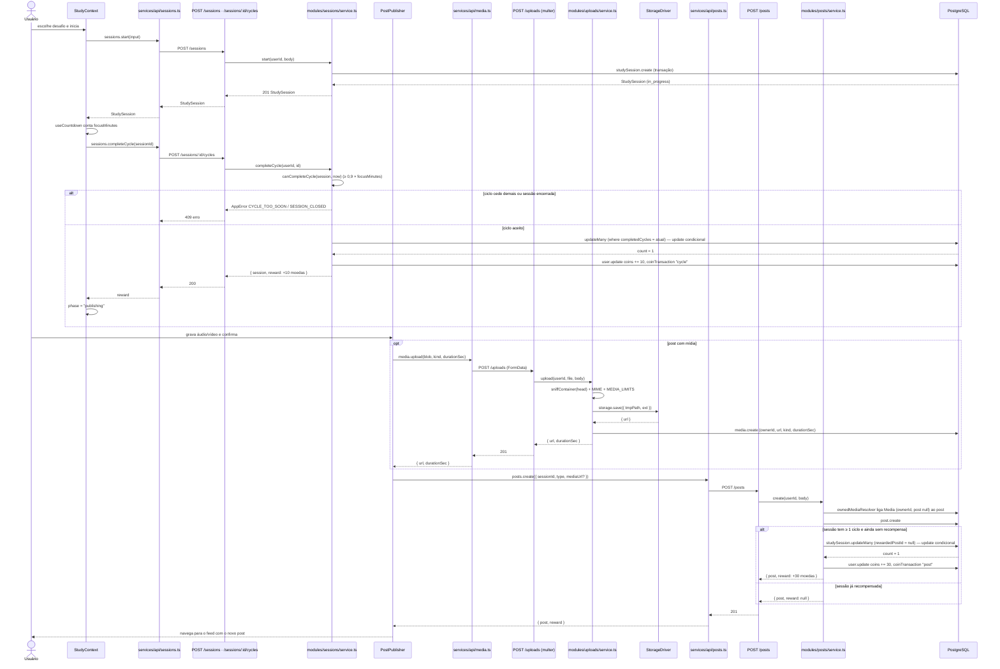
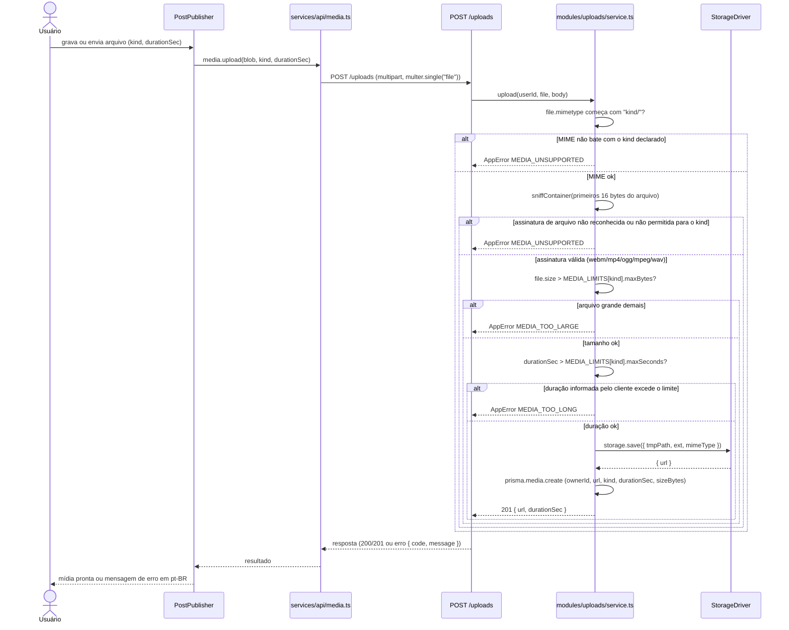
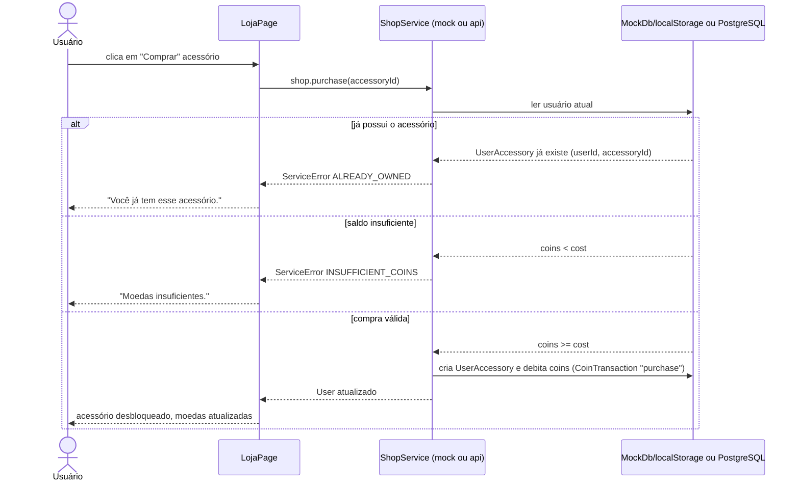
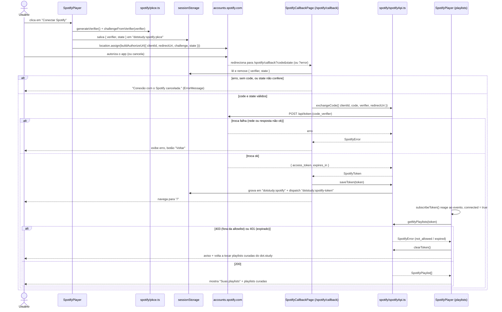
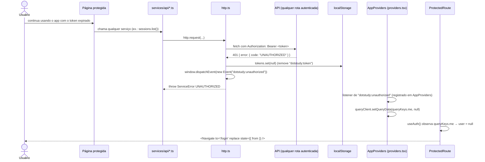
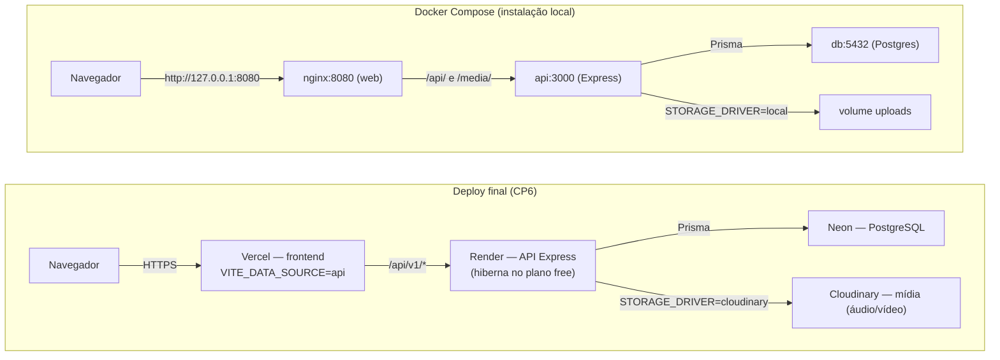
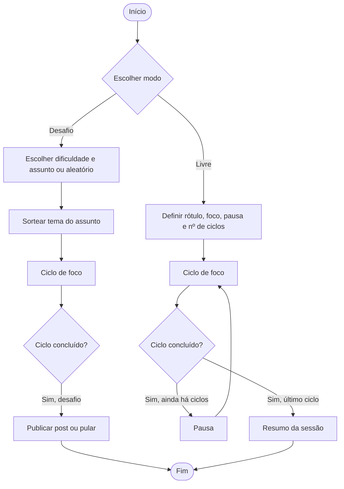

# Modelagem UML

Diagramas em Mermaid, renderizados diretamente no GitHub (sem depender de ferramenta externa) e validados localmente com `@mermaid-js/mermaid-cli`. O diagrama de classes reflete o schema real do Prisma (`backend/prisma/schema.prisma`); os diagramas de sequência descrevem o código real dos dois modos — mock (`frontend/src/services/mock/`) e API (`frontend/src/services/api/` + `backend/src/modules/`) —; o diagrama de implantação cobre o deploy final e a instalação via Docker Compose.

## Diagrama de Classes

Modelo do banco de dados (`backend/prisma/schema.prisma`), já no modo API do CP6: inclui a entidade `Media` (um arquivo de áudio/vídeo enviado por um usuário) e o campo `Post.mediaId`, que liga um post à mídia que ele usa.

```mermaid
classDiagram
    class User {
        +id
        +name
        +email
        +passwordHash
        +coins
        +dotColor
        +activeAccessoryId
        +createdAt
    }
    class Subject {
        +id
        +name
        +color
        +icon
    }
    class Theme {
        +id
        +title
        +subjectId
    }
    class StudySession {
        +id
        +userId
        +mode
        +subjectId
        +themeId
        +label
        +focusMinutes
        +breakMinutes
        +plannedCycles
        +completedCycles
        +notes
        +status
        +startedAt
        +lastCycleAt
        +finishedAt
        +rewardedPostId
    }
    class Post {
        +id
        +authorId
        +sessionId
        +subjectId
        +type
        +title
        +content
        +mediaId
        +mediaUrl
        +mediaDurationSec
        +baseLikeCount
        +createdAt
    }
    class Media {
        +id
        +ownerId
        +url
        +kind
        +durationSec
        +sizeBytes
        +createdAt
    }
    class Comment {
        +id
        +postId
        +authorId
        +parentId
        +content
        +createdAt
    }
    class Like {
        +userId
        +postId
    }
    class Save {
        +userId
        +postId
    }
    class Accessory {
        +id
        +name
        +cost
    }
    class UserAccessory {
        +userId
        +accessoryId
        +unlockedAt
    }
    class CoinTransaction {
        +id
        +userId
        +amount
        +reason
        +refId
        +createdAt
    }

    User "1" --> "*" StudySession
    User "1" --> "*" Post
    User "1" --> "*" Comment
    User "1" --> "*" CoinTransaction
    User "1" --> "*" Media : dono (ownerId)
    User "*" --> "*" Accessory : UserAccessory (desbloqueou)
    StudySession "1" --> "0..1" Post : rewardedPostId
    StudySession "*" --> "0..1" Theme
    StudySession "*" --> "0..1" Subject
    Theme "*" --> "1" Subject
    Post "*" --> "0..1" Subject
    Post "0..1" --> "1" Media : mediaId (unique)
    Post "1" --> "*" Comment
    Post "1" --> "*" Like
    Post "1" --> "*" Save
    Comment "0..1" --> "*" Comment : replies (parentId)
```

> **Notas sobre o modelo** (histórico completo em `docs/08-jornada.md`): `PerfilDot` foi incorporado ao `User` (`dotColor` + `activeAccessoryId`); `Post` tem campo `type` (`text`/`audio`/`video`) e campos de mídia; `Comment` tem `parentId` para permitir respostas; `Like` e `Save` são entidades de chave composta (`userId` + `postId`); `CoinTransaction` registra cada crédito/débito de moeda (`reason`: `welcome`, `cycle`, `post` ou `purchase`). **Nenhuma tabela de ranking existe**: a pontuação por assunto é calculada por consulta sobre `StudySession` e `Post` (`modules/rankings/service.ts` no backend; `computeSubjectScores` em `frontend/src/domain/rules.ts` no mock), evitando dado duplicado. `Media` é dona do arquivo (`ownerId`, URL, tipo, duração, tamanho); um post só referencia uma mídia já enviada pelo próprio autor e ainda não usada em outro post (`mediaId` é `@unique`, e o resolver de mídia do backend confere `ownerId`/`kind`/`post: null` antes de aceitar).

## Diagrama de Caso de Uso

Mermaid não tem um tipo nativo para diagrama de caso de uso; representado como `flowchart` seguindo a convenção ator → elipses de caso de uso.

```mermaid
flowchart LR
    Usuario(("👤 Usuário"))
    UC0a([Cadastrar-se])
    UC0b([Entrar])
    UC1([Selecionar assunto de estudo])
    UC2([Iniciar sessão de pomodoro])
    UC3([Registrar anotações])
    UC4([Publicar post - texto, áudio ou vídeo])
    UC5([Visualizar feed])
    UC5b([Comentar em um post])
    UC5c([Curtir / salvar post])
    UC6([Visualizar ranking])
    UC7([Customizar personagem dot])
    UC8([Visualizar perfil do usuário])
    UC9([Ouvir música / Conectar Spotify])

    Usuario --> UC0a
    Usuario --> UC0b
    Usuario --> UC1
    Usuario --> UC2
    Usuario --> UC3
    Usuario --> UC4
    Usuario --> UC5
    Usuario --> UC5b
    Usuario --> UC5c
    Usuario --> UC6
    Usuario --> UC7
    Usuario --> UC8
    Usuario --> UC9
    UC2 -. include .-> UC3
```

## Diagrama de Sequência — Login com JWT (modo API)

Representa `frontend/src/pages/LoginPage.tsx` chamando `useAuth` (`frontend/src/hooks/useAuth.tsx`), que delega a `createApiAuthService` (`frontend/src/services/api/auth.ts`) sobre o `http.ts` (`frontend/src/services/api/http.ts`). No backend, `POST /api/v1/auth/login` é tratado por `modules/auth/service.ts`, que compara a senha com `bcryptjs` e assina um JWT (`signToken`, HS256, validade 7 dias). O token volta para o frontend e é guardado em `localStorage["dotstudy:token"]` (`services/api/tokens.ts`).

```mermaid
sequenceDiagram
    actor U as Usuário
    participant LP as LoginPage
    participant Auth as useAuth
    participant Svc as services/api/auth.ts
    participant Http as http.ts
    participant API as POST /api/v1/auth/login
    participant AuthSvc as modules/auth/service.ts
    participant DB as PostgreSQL
    participant LS as localStorage

    U ->> LP: preenche email e senha
    LP ->> Auth: login(email, senha)
    Auth ->> Svc: auth.login({ email, password })
    Svc ->> Http: http.request("POST", "/auth/login", { body })
    Http ->> API: fetch com Content-Type: application/json
    API ->> AuthSvc: login(body)
    AuthSvc ->> DB: prisma.user.findUnique({ email })
    alt usuário não existe ou senha não confere
        AuthSvc ->> AuthSvc: bcrypt.compare(password, passwordHash) = false
        AuthSvc -->> API: AppError INVALID_CREDENTIALS
        API -->> Http: 401 { error: { code, message } }
        Http -->> Svc: throw ServiceError
        Svc -->> Auth: erro
        Auth -->> LP: erro
        LP -->> U: "Email ou senha incorretos."
    else credencial válida
        DB -->> AuthSvc: User
        AuthSvc ->> AuthSvc: signToken(env, user.id) (JWT HS256, 7d)
        AuthSvc -->> API: { token, user }
        API -->> Http: 200 { token, user }
        Http ->> LS: tokens.set(token) ("dotstudy:token")
        Http -->> Svc: user
        Svc -->> Auth: User
        Auth ->> Auth: queryClient.setQueryData(queryKeys.me, User)
        Auth -->> LP: sucesso
        LP -->> U: navega para "/"
    end
```

## Diagrama de Sequência — Sessão de estudo, ciclo e publicação na API

Representa `frontend/src/content/StudyContext.tsx` (contador em `frontend/src/hooks/useCountdown.ts`) chamando `services/api/sessions.ts`, que fala com `POST /sessions` e `POST /sessions/:id/cycles` (`modules/sessions/service.ts`); a publicação via `frontend/src/components/PostPublisher.tsx`, que sobe a mídia por `services/api/media.ts` → `POST /uploads` (multer → sniff da assinatura do arquivo → `StorageDriver`, em `modules/uploads/`) e cria o post por `services/api/posts.ts` → `POST /posts` (`modules/posts/service.ts`, com `ownedMediaResolver` ligando a mídia já enviada ao post).

```mermaid
sequenceDiagram
    actor U as Usuário
    participant SC as StudyContext
    participant SSvc as services/api/sessions.ts
    participant SessAPI as POST /sessions · /sessions/:id/cycles
    participant SessSvc as modules/sessions/service.ts
    participant PP as PostPublisher
    participant MSvc as services/api/media.ts
    participant UpAPI as POST /uploads (multer)
    participant UpSvc as modules/uploads/service.ts
    participant Storage as StorageDriver
    participant PSvc as services/api/posts.ts
    participant PostAPI as POST /posts
    participant PostSvc as modules/posts/service.ts
    participant DB as PostgreSQL

    U ->> SC: escolhe desafio e inicia
    SC ->> SSvc: sessions.start(input)
    SSvc ->> SessAPI: POST /sessions
    SessAPI ->> SessSvc: start(userId, body)
    SessSvc ->> DB: studySession.create (transação)
    DB -->> SessSvc: StudySession (in_progress)
    SessSvc -->> SessAPI: 201 StudySession
    SessAPI -->> SSvc: StudySession
    SSvc -->> SC: StudySession
    SC ->> SC: useCountdown conta focusMinutes

    SC ->> SSvc: sessions.completeCycle(sessionId)
    SSvc ->> SessAPI: POST /sessions/:id/cycles
    SessAPI ->> SessSvc: completeCycle(userId, id)
    SessSvc ->> SessSvc: canCompleteCycle(session, now) (≥ 0,9 × focusMinutes)
    alt ciclo cedo demais ou sessão encerrada
        SessSvc -->> SessAPI: AppError CYCLE_TOO_SOON / SESSION_CLOSED
        SessAPI -->> SSvc: 409 erro
    else ciclo aceito
        SessSvc ->> DB: updateMany (where completedCycles = atual) — update condicional
        DB -->> SessSvc: count = 1
        SessSvc ->> DB: user.update coins += 10, coinTransaction "cycle"
        SessSvc -->> SessAPI: { session, reward: +10 moedas }
        SessAPI -->> SSvc: 200
        SSvc -->> SC: reward
        SC ->> SC: phase = "publishing"
    end

    U ->> PP: grava áudio/vídeo e confirma
    opt post com mídia
        PP ->> MSvc: media.upload(blob, kind, durationSec)
        MSvc ->> UpAPI: POST /uploads (FormData)
        UpAPI ->> UpSvc: upload(userId, file, body)
        UpSvc ->> UpSvc: sniffContainer(head) + MIME + MEDIA_LIMITS
        UpSvc ->> Storage: storage.save({ tmpPath, ext })
        Storage -->> UpSvc: { url }
        UpSvc ->> DB: media.create (ownerId, url, kind, durationSec)
        UpSvc -->> UpAPI: { url, durationSec }
        UpAPI -->> MSvc: 201
        MSvc -->> PP: { url, durationSec }
    end
    PP ->> PSvc: posts.create({ sessionId, type, mediaUrl? })
    PSvc ->> PostAPI: POST /posts
    PostAPI ->> PostSvc: create(userId, body)
    PostSvc ->> DB: ownedMediaResolver liga Media (ownerId, post null) ao post
    PostSvc ->> DB: post.create
    alt sessão tem ≥ 1 ciclo e ainda sem recompensa
        PostSvc ->> DB: studySession.updateMany (rewardedPostId = null) — update condicional
        DB -->> PostSvc: count = 1
        PostSvc ->> DB: user.update coins += 30, coinTransaction "post"
        PostSvc -->> PostAPI: { post, reward: +30 moedas }
    else sessão já recompensada
        PostSvc -->> PostAPI: { post, reward: null }
    end
    PostAPI -->> PSvc: 201
    PSvc -->> PP: { post, reward }
    PP -->> U: navega para o feed com o novo post
```

## Diagrama de Sequência — Upload de mídia e ramos de erro

Representa `modules/uploads/service.ts`: a validação acontece em camadas (MIME declarado pelo navegador → assinatura real do arquivo lida do disco → tamanho → duração informada pelo cliente), cada uma podendo encerrar o fluxo com um `ServiceErrorCode` específico (`MEDIA_UNSUPPORTED`, `MEDIA_TOO_LARGE`, `MEDIA_TOO_LONG`) antes de gravar no `StorageDriver`.

```mermaid
sequenceDiagram
    actor U as Usuário
    participant PP as PostPublisher
    participant MSvc as services/api/media.ts
    participant API as POST /uploads
    participant UpSvc as modules/uploads/service.ts
    participant Storage as StorageDriver

    U ->> PP: grava ou envia arquivo (kind, durationSec)
    PP ->> MSvc: media.upload(blob, kind, durationSec)
    MSvc ->> API: POST /uploads (multipart, multer.single("file"))
    API ->> UpSvc: upload(userId, file, body)
    UpSvc ->> UpSvc: file.mimetype começa com "kind/"?
    alt MIME não bate com o kind declarado
        UpSvc -->> API: AppError MEDIA_UNSUPPORTED
    else MIME ok
        UpSvc ->> UpSvc: sniffContainer(primeiros 16 bytes do arquivo)
        alt assinatura de arquivo não reconhecida ou não permitida para o kind
            UpSvc -->> API: AppError MEDIA_UNSUPPORTED
        else assinatura válida (webm/mp4/ogg/mpeg/wav)
            UpSvc ->> UpSvc: file.size > MEDIA_LIMITS[kind].maxBytes?
            alt arquivo grande demais
                UpSvc -->> API: AppError MEDIA_TOO_LARGE
            else tamanho ok
                UpSvc ->> UpSvc: durationSec > MEDIA_LIMITS[kind].maxSeconds?
                alt duração informada pelo cliente excede o limite
                    UpSvc -->> API: AppError MEDIA_TOO_LONG
                else duração ok
                    UpSvc ->> Storage: storage.save({ tmpPath, ext, mimeType })
                    Storage -->> UpSvc: { url }
                    UpSvc ->> UpSvc: prisma.media.create (ownerId, url, kind, durationSec, sizeBytes)
                    UpSvc -->> API: 201 { url, durationSec }
                end
            end
        end
    end
    API -->> MSvc: resposta (200/201 ou erro { code, message })
    MSvc -->> PP: resultado
    PP -->> U: mídia pronta ou mensagem de erro em pt-BR
```

> A duração (`durationSec`) é declarada pelo navegador (medida pelo `MediaRecorder`/`<video>`/`<audio>`), não recalculada no servidor — ver trade-off em `docs/08-jornada.md`.

## Diagrama de Sequência — Compra na loja

Representa `frontend/src/pages/LojaPage.tsx` chamando `ShopService.purchase`. No modo mock, `frontend/src/services/mock/shop.ts` lê/grava o `MockDb` sobre `localStorage`; no modo API, `frontend/src/services/api/shop.ts` chama `POST /api/v1/shop/purchase`, tratado por `modules/shop/service.ts` — a chave primária composta (`userId`, `accessoryId`) de `UserAccessory` impede o desbloqueio em duplicidade sob concorrência, e um `updateMany` condicional (`coins >= cost`) evita saldo negativo.

```mermaid
sequenceDiagram
    actor U as Usuário
    participant LJ as LojaPage
    participant Svc as ShopService (mock ou api)
    participant DB as MockDb/localStorage ou PostgreSQL

    U ->> LJ: clica em "Comprar" acessório
    LJ ->> Svc: shop.purchase(accessoryId)
    Svc ->> DB: ler usuário atual
    alt já possui o acessório
        DB -->> Svc: UserAccessory já existe (userId, accessoryId)
        Svc -->> LJ: ServiceError ALREADY_OWNED
        LJ -->> U: "Você já tem esse acessório."
    else saldo insuficiente
        DB -->> Svc: coins < cost
        Svc -->> LJ: ServiceError INSUFFICIENT_COINS
        LJ -->> U: "Moedas insuficientes."
    else compra válida
        DB -->> Svc: coins >= cost
        Svc ->> DB: cria UserAccessory e debita coins (CoinTransaction "purchase")
        Svc -->> LJ: User atualizado
        LJ -->> U: acessório desbloqueado, moedas atualizadas
    end
```

## Diagrama de Sequência — Conexão Spotify (PKCE)

Representa `frontend/src/components/spotify/SpotifyPlayer.tsx` gerando o par verifier/challenge (`frontend/src/spotify/pkce.ts`) e redirecionando para `accounts.spotify.com`; o retorno é tratado por `frontend/src/pages/SpotifyCallbackPage.tsx` (rota `/spotify/callback`), que troca o código por um token (`exchangeCode`, `frontend/src/spotify/spotifyApi.ts`) e o guarda com `saveToken` (`sessionStorage`, evento `dotstudy:spotify-token`). O `SpotifyPlayer` escuta esse evento e busca as playlists do usuário.

```mermaid
sequenceDiagram
    actor U as Usuário
    participant SP as SpotifyPlayer
    participant PKCE as spotify/pkce.ts
    participant SS as sessionStorage
    participant Spotify as accounts.spotify.com
    participant CB as SpotifyCallbackPage (/spotify/callback)
    participant API as spotify/spotifyApi.ts
    participant Player as SpotifyPlayer (playlists)

    U ->> SP: clica em "Conectar Spotify"
    SP ->> PKCE: generateVerifier() + challengeFromVerifier(verifier)
    SP ->> SS: salva { verifier, state } em "dotstudy:spotify:pkce"
    SP ->> Spotify: location.assign(buildAuthorizeUrl({ clientId, redirectUri, challenge, state }))
    U ->> Spotify: autoriza o app (ou cancela)
    Spotify -->> CB: redireciona para /spotify/callback?code&state (ou ?error)
    CB ->> SS: lê e remove { verifier, state }
    alt erro, sem code, ou state não confere
        CB -->> U: "Conexão com o Spotify cancelada." (ErrorMessage)
    else code e state válidos
        CB ->> API: exchangeCode({ clientId, code, verifier, redirectUri })
        API ->> Spotify: POST /api/token (code_verifier)
        alt troca falha (rede ou resposta não ok)
            Spotify -->> API: erro
            API -->> CB: SpotifyError
            CB -->> U: exibe erro, botão "Voltar"
        else troca ok
            Spotify -->> API: { access_token, expires_in }
            API -->> CB: SpotifyToken
            CB ->> API: saveToken(token)
            API ->> SS: grava em "dotstudy:spotify" + dispatch "dotstudy:spotify-token"
            CB -->> U: navega para "/"
            Player ->> Player: subscribeToken() reage ao evento, connected = true
            Player ->> API: getMyPlaylists(token)
            alt 403 (fora da allowlist) ou 401 (expirado)
                API -->> Player: SpotifyError (not_allowed / expired)
                Player ->> API: clearToken()
                Player -->> U: aviso + volta a tocar playlists curadas do dot.study
            else 200
                API -->> Player: SpotifyPlaylist[]
                Player -->> U: mostra "Suas playlists" + playlists curadas
            end
        end
    end
```

## Diagrama de Sequência — Sessão expirada

Representa `frontend/src/services/api/http.ts`: qualquer resposta `401` de uma rota autenticada apaga o token (`tokens.set(null)`) e dispara o evento `dotstudy:unauthorized`, ouvido por `AppProviders` (`frontend/src/app/providers.tsx`), que zera a query `me`. O `ProtectedRoute` (`frontend/src/app/ProtectedRoute.tsx`), observando `useAuth()`, troca o `<Outlet/>` por um redirecionamento para `/login` assim que `user` fica `null`.

```mermaid
sequenceDiagram
    actor U as Usuário
    participant Page as Página protegida
    participant Svc as services/api/*.ts
    participant Http as http.ts
    participant API as API (qualquer rota autenticada)
    participant LS as localStorage
    participant Prov as AppProviders (providers.tsx)
    participant PR as ProtectedRoute

    U ->> Page: continua usando o app com o token expirado
    Page ->> Svc: chama qualquer serviço (ex.: sessions.list())
    Svc ->> Http: http.request(...)
    Http ->> API: fetch com Authorization: Bearer <token>
    API -->> Http: 401 { error: { code: "UNAUTHORIZED" } }
    Http ->> LS: tokens.set(null) (remove "dotstudy:token")
    Http ->> Http: window.dispatchEvent(new Event("dotstudy:unauthorized"))
    Http -->> Svc: throw ServiceError UNAUTHORIZED
    Prov ->> Prov: listener de "dotstudy:unauthorized" (registrado em AppProviders)
    Prov ->> Prov: queryClient.setQueryData(queryKeys.me, null)
    PR ->> PR: useAuth() observa queryKeys.me → user = null
    PR -->> U: <Navigate to="/login" replace state={{ from }} />
```

## Diagrama de Implantação

```mermaid
flowchart LR
    subgraph Deploy["Deploy final (CP6)"]
        direction LR
        Browser1["Navegador"] -->|HTTPS| Vercel["Vercel — frontend\nVITE_DATA_SOURCE=api"]
        Vercel -->|"/api/v1/*"| Render["Render — API Express\n(hiberna no plano free)"]
        Render -->|Prisma| Neon["Neon — PostgreSQL"]
        Render -->|STORAGE_DRIVER=cloudinary| Cloudinary["Cloudinary — mídia (áudio/vídeo)"]
    end

    subgraph Docker["Docker Compose (instalação local)"]
        direction LR
        Browser2["Navegador"] -->|"http://127.0.0.1:8080"| Nginx["nginx:8080 (web)"]
        Nginx -->|"/api/ e /media/"| Api2["api:3000 (Express)"]
        Api2 -->|Prisma| Db2["db:5432 (Postgres)"]
        Api2 -->|STORAGE_DRIVER=local| Vol["volume uploads"]
    end
```

> No deploy final, o frontend fala só com o seu próprio domínio na Vercel (requisições relativas) e esse domínio é configurado para encaminhar `/api/v1/*` ao Render; `WEB_ORIGIN` no Render lista as origens permitidas por CORS. No Docker, o `nginx.conf` do serviço `web` faz proxy de `/api/` e `/media/` para `api:3000`, então o navegador fala só com `127.0.0.1:8080` (mesma origem, sem CORS) — ver `frontend/nginx.conf` e `docker-compose.yml`.

## Diagramas de Atividade (CP5, continuam valendo)

Os diagramas abaixo descrevem o fluxo de telas, que não mudou do CP5 para o CP6 (RNF04): o que muda é só a camada de dados por trás (mock ou API), conforme `VITE_DATA_SOURCE`.

### Fluxo de estudo

Representa o fluxo controlado por `frontend/src/content/StudyContext.tsx` em `frontend/src/pages/EstudarPage.tsx`: escolha do modo, ciclos de foco/pausa via `useCountdown`, e o desfecho (publicar no modo desafio, resumo no modo livre). No modo mock, `startSession`/`completeCycle` são resolvidos por `frontend/src/services/mock/sessions.ts`; no modo API, pelas rotas `POST /sessions` e `POST /sessions/:id/cycles` descritas no diagrama de sequência acima.

```mermaid
flowchart TD
    A([Início]) --> B{Escolher modo}
    B -->|Desafio| C[Escolher dificuldade e assunto ou aleatório]
    C --> D[Sortear tema do assunto]
    D --> E[Ciclo de foco]
    B -->|Livre| F[Definir rótulo, foco, pausa e nº de ciclos]
    F --> G[Ciclo de foco]
    E --> H{Ciclo concluído?}
    G --> H2{Ciclo concluído?}
    H -->|Sim, desafio| I[Publicar post ou pular]
    H2 -->|Sim, ainda há ciclos| J[Pausa]
    J --> G
    H2 -->|Sim, último ciclo| K[Resumo da sessão]
    I --> L([Fim])
    K --> L
```

### Publicação

Representa `frontend/src/components/PostPublisher.tsx`: escolha do tipo de post, gravação/envio de mídia (áudio ou vídeo, via `frontend/src/hooks/useMediaRecorder.ts`), validação de limites e a recompensa condicional. No modo mock, o upload e a criação do post são resolvidos por `frontend/src/services/mock/media.ts` e `frontend/src/services/mock/posts.ts` (blob guardado no IndexedDB); no modo API, pelas rotas `POST /uploads` e `POST /posts` (`modules/uploads/` e `modules/posts/`), com a validação de limite e assinatura do arquivo feita no servidor em vez do navegador.

```mermaid
flowchart TD
    A([Início]) --> B{Escolher tipo de post}
    B -->|Texto| C[Escrever título e conteúdo]
    B -->|Áudio ou vídeo| D[Gravar no navegador ou enviar arquivo]
    D --> E{Duração e tamanho dentro do limite?}
    E -->|Não| F[Exibir erro e manter rascunho]
    F --> D
    E -->|Sim| G[Mídia pronta]
    C --> H[Enviar]
    G --> H
    H --> I[Criar post]
    I --> J{Sessão já teve recompensa?}
    J -->|Não| K[Creditar +30 moedas / +30 pontos se houver assunto]
    J -->|Sim| L[Sem recompensa adicional]
    K --> M([Fim])
    L --> M
```
