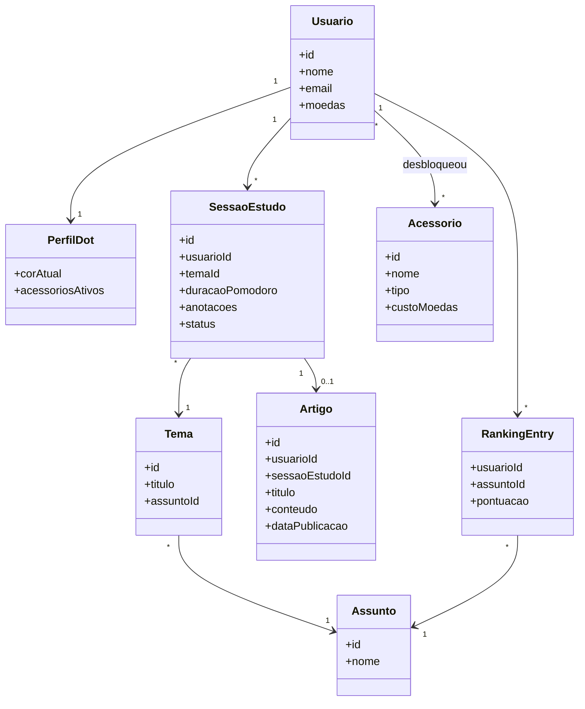
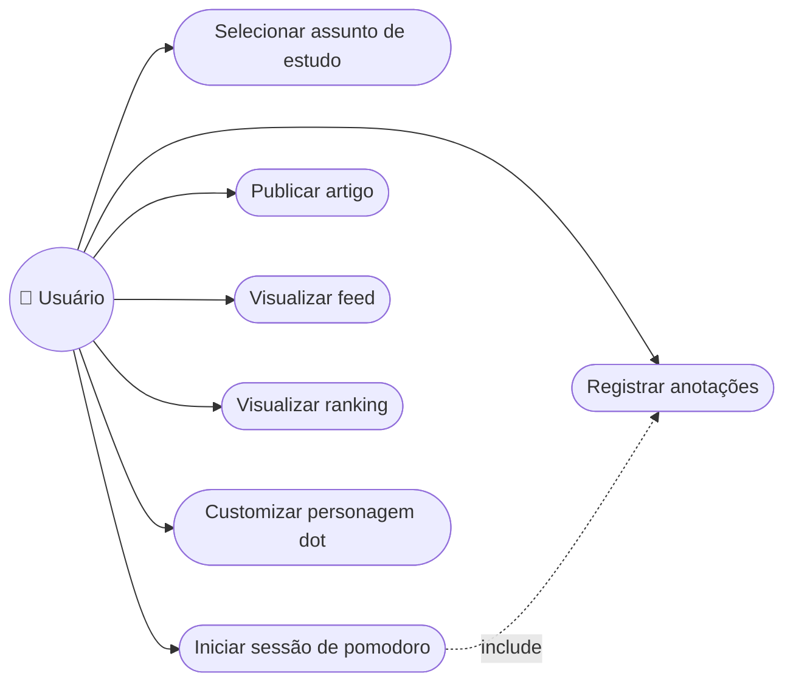

# CP4 Idealização Implementation Plan

> **For agentic workers:** REQUIRED SUB-SKILL: Use superpowers:subagent-driven-development (recommended) or superpowers:executing-plans to implement this plan task-by-task. Steps use checkbox (`- [ ]`) syntax for tracking.

**Goal:** Materializar o design do CP4 (spec `docs/superpowers/specs/2026-08-11-dot-study-cp4-design.md`) como os arquivos reais do repositório `dot-study`: documentação completa em `docs/`, esqueleto de pastas `frontend/`/`backend/`, e README final com toda a navegação.

**Architecture:** Cada seção da spec vira um arquivo Markdown independente em `docs/`, evitando um único documento monolítico. O README final referencia todos eles. Diagramas UML ficam em Mermaid dentro do markdown (renderizam nativamente no GitHub) e são validados localmente com `@mermaid-js/mermaid-cli` antes do commit, para pegar erro de sintaxe sem depender de abrir o GitHub.

**Tech Stack:** Markdown puro + Mermaid para diagramas. Nenhum código de aplicação é escrito neste plano (React/Node ficam para o CP5) — apenas o esqueleto vazio das pastas `frontend/` e `backend/`.

## Global Constraints

- Stack de app definida na spec: React (frontend) + Node/Express (backend) — só documentada aqui, não implementada.
- Diagramas UML devem ser Mermaid, sem depender de ferramenta externa para renderizar no GitHub.
- Paleta de marca: fundo `#F7F7FA`, texto `#111827`, acento primário `#4F46E5`, acento secundário `#9CA3AF`.
- Tipografia de marca: Inter ou Poppins.
- Colunas mínimas do Trello: Backlog / To Do / Doing / Done.
- Fora do escopo v1 (não documentar como implementado): sistema de eventos, persistência real, apps nativos mobile.
- Equipe (usar em README e docs/07-trello.md exatamente assim):
  | Nome | RM |
  |---|---|
  | Lucas Rodrigues Grecco | 558261 |
  | Monique Ferreira dos Anjos | 558262 |
  | Tiago Brito Nário | 558248 |
  | Felipe Wapf Fettback | 557217 |
  | Leonardo Tanaka Cortez | 556781 |
  | Rafael Augusto Oliveira Silva | 555154 |
- Repositório remoto já configurado: `git@github.com:lucvs07/dot-study.git`, branch `main`, com um commit inicial (README mínimo + spec).

---

### Task 1: docs/01-problema-e-persona.md

**Files:**
- Create: `docs/01-problema-e-persona.md`

**Interfaces:**
- Consumes: nenhum
- Produces: arquivo referenciado pelo README na Task 9 como "Problema e Persona"

- [ ] **Step 1: Escrever o conteúdo do arquivo**

```markdown
# Problema e Persona

## Problema

Quem estuda sozinho — fora de uma sala de aula com rotina imposta — tem dificuldade em manter consistência e motivação. Não há com quem trocar o que foi aprendido, nem um sinal claro de progresso ao longo do tempo.

## Persona

**Estudante autônomo.** Universitário, vestibulando ou profissional em transição de carreira, que estuda temas como tecnologia, marketing ou economia por conta própria (fora de um curso formal). Quer se manter motivado e visualizar sua evolução.

## Proposta de valor

O dot.study transforma sessões de estudo solo em um ciclo com foco (pomodoro), registro (notas), compartilhamento (artigo) e recompensa (moedas + ranking). O estudo deixa de ser um esforço isolado e invisível.
```

- [ ] **Step 2: Verificar o conteúdo**

Run: `grep -c "^## " docs/01-problema-e-persona.md`
Expected: `3` (Problema, Persona, Proposta de valor)

- [ ] **Step 3: Commit**

```bash
git add docs/01-problema-e-persona.md
git commit -m "docs: adicionar problema e persona (CP4)"
```

---

### Task 2: docs/02-requisitos.md

**Files:**
- Create: `docs/02-requisitos.md`

**Interfaces:**
- Consumes: nenhum
- Produces: arquivo referenciado pelo README na Task 9 como "Requisitos"

- [ ] **Step 1: Escrever o conteúdo do arquivo**

```markdown
# Requisitos Funcionais e Não Funcionais

## Requisitos Funcionais (RF)

| # | Requisito |
|---|---|
| RF01 | O sistema deve permitir selecionar uma área de assunto |
| RF02 | O sistema deve sugerir uma temática aleatória dentro da área escolhida |
| RF03 | O sistema deve fornecer um timer pomodoro configurável (duração de foco/pausa) |
| RF04 | O sistema deve permitir registrar anotações durante a sessão de estudo |
| RF05 | O sistema deve permitir publicar um artigo com base na sessão de estudo |
| RF06 | O sistema deve exibir um feed com os artigos publicados pela comunidade |
| RF07 | O sistema deve calcular e exibir um ranking de usuários por assunto |
| RF08 | O sistema deve conceder moedas por ações de engajamento (pomodoro completo, artigo publicado) |
| RF09 | O sistema deve permitir customizar o personagem "dot" (cor, acessórios) usando moedas acumuladas |
| RF10 | O sistema deve exibir um perfil do usuário com progresso, moedas e personagem customizado |

> **Nota sobre pontuação/moedas:** tanto o ranking (RF07) quanto as moedas (RF08) são derivados do número de pomodoros completos e artigos publicados dentro de um assunto. A fórmula exata de conversão (quantas moedas por pomodoro, peso do artigo no ranking, etc.) é um detalhe de implementação a ser definido no CP5, quando o protótipo mockado entrar em construção.

## Requisitos Não Funcionais (RNF)

| # | Requisito |
|---|---|
| RNF01 | Interface responsiva (desktop e mobile via navegador) |
| RNF02 | Telas principais devem carregar com fluidez perceptível (sem loaders longos) |
| RNF03 | Frontend organizado em componentes reutilizáveis (React), preparando evolução para CP5/CP6 |
| RNF04 | Dados mockados devem seguir um contrato de dados definido, para troca por API real no CP6 sem retrabalho de tela |
| RNF05 | Identidade visual (paleta, tipografia, mascote) aplicada de forma consistente entre todas as telas |
| RNF06 | Aplicação hospedada em serviço gratuito de deploy, acessível publicamente a partir do CP5 |
```

- [ ] **Step 2: Verificar o conteúdo**

Run: `grep -c "^| RF" docs/02-requisitos.md && grep -c "^| RNF" docs/02-requisitos.md`
Expected: `10` linhas de RF, `6` linhas de RNF

- [ ] **Step 3: Commit**

```bash
git add docs/02-requisitos.md
git commit -m "docs: adicionar requisitos funcionais e não funcionais (CP4)"
```

---

### Task 3: docs/03-escopo.md

**Files:**
- Create: `docs/03-escopo.md`

**Interfaces:**
- Consumes: nenhum
- Produces: arquivo referenciado pelo README na Task 9 como "Escopo"

- [ ] **Step 1: Escrever o conteúdo do arquivo**

```markdown
# Escopo do Projeto (v1)

## Dentro do escopo

- Seleção de área de assunto (tecnologia, marketing, economia, etc.)
- Sugestão de temática aleatória dentro do assunto escolhido
- Sessão de estudo com pomodoro configurável + bloco de anotações
- Publicação de artigo a partir da sessão de estudo
- Feed com os artigos publicados pela comunidade
- Ranking de usuários por assunto
- Personagem "dot" customizável (cor, acessórios), com moedas ganhas por engajamento (pomodoro completo, artigo publicado)
- Dados mockados (sem persistência real) — protótipo funcional no CP5

## Fora do escopo (v1)

- Sistema de eventos (desafios temáticos, maratonas de estudo) — fica para versão futura
- Persistência real / autenticação real / API real — entra no CP6
- Apps nativos mobile — v1 é web app responsivo
```

- [ ] **Step 2: Verificar o conteúdo**

Run: `grep -c "^- " docs/03-escopo.md`
Expected: `11` (8 itens dentro + 3 itens fora do escopo)

- [ ] **Step 3: Commit**

```bash
git add docs/03-escopo.md
git commit -m "docs: adicionar escopo do projeto v1 (CP4)"
```

---

### Task 4: docs/04-modelagem-uml.md

**Files:**
- Create: `docs/04-modelagem-uml.md`

**Interfaces:**
- Consumes: nenhum
- Produces: arquivo referenciado pelo README na Task 9 como "Modelagem UML"

- [ ] **Step 1: Escrever o conteúdo do arquivo**

```markdown
# Modelagem UML

Diagramas em Mermaid, renderizados diretamente no GitHub (sem depender de ferramenta externa).

## Diagrama de Classes



## Diagrama de Caso de Uso

Mermaid não tem um tipo nativo para diagrama de caso de uso; representado como `flowchart` seguindo a convenção ator → elipses de caso de uso.


```

- [ ] **Step 2: Extrair os diagramas para arquivos temporários**

```bash
mkdir -p /tmp/mmd-check
sed -n '/^classDiagram/,/^```$/p' docs/04-modelagem-uml.md | sed '$d' > /tmp/mmd-check/classes.mmd
sed -n '/^flowchart LR/,/^```$/p' docs/04-modelagem-uml.md | sed '$d' > /tmp/mmd-check/casos-de-uso.mmd
cat /tmp/mmd-check/classes.mmd
cat /tmp/mmd-check/casos-de-uso.mmd
```

Expected: os dois arquivos contêm, respectivamente, o `classDiagram` completo e o `flowchart LR` completo (sem a linha ` ``` ` final).

- [ ] **Step 3: Validar sintaxe dos diagramas com mermaid-cli**

Run:
```bash
npx -y @mermaid-js/mermaid-cli -i /tmp/mmd-check/classes.mmd -o /tmp/mmd-check/classes.svg
npx -y @mermaid-js/mermaid-cli -i /tmp/mmd-check/casos-de-uso.mmd -o /tmp/mmd-check/casos-de-uso.svg
```
Expected: ambos os comandos terminam sem erro e geram `classes.svg` e `casos-de-uso.svg` em `/tmp/mmd-check/`. Se o `npx` falhar por falta de acesso à internet/sandbox de browser, confirme visualmente a sintaxe (chaves e setas balanceadas) e valide depois abrindo o arquivo pelo GitHub, que renderiza Mermaid nativamente.

- [ ] **Step 4: Limpar arquivos temporários**

```bash
rm -rf /tmp/mmd-check
```

- [ ] **Step 5: Commit**

```bash
git add docs/04-modelagem-uml.md
git commit -m "docs: adicionar modelagem UML (classes e caso de uso) (CP4)"
```

---

### Task 5: docs/05-marca.md

**Files:**
- Create: `docs/05-marca.md`

**Interfaces:**
- Consumes: nenhum
- Produces: arquivo referenciado pelo README na Task 9 como "Identidade Visual"

- [ ] **Step 1: Escrever o conteúdo do arquivo**

```markdown
# Identidade Visual

## Nome

dot.study

## Estilo

Foco Minimalista — fundo neutro claro com um único acento vibrante, mascote simples e geométrico.

## Paleta

| Uso | Cor | Hex |
|---|---|---|
| Fundo | Cinza-claro | `#F7F7FA` |
| Texto | Quase-preto | `#111827` |
| Acento primário | Índigo | `#4F46E5` |
| Acento secundário/neutro | Cinza médio | `#9CA3AF` |

## Tipografia

Sans-serif moderna: Inter ou Poppins, para títulos e corpo de texto.

## Mascote "dot"

Círculo simples com olhos grandes arredondados e bochechas rosadas (estilo "kawaii" discreto). Customizável por cor e por acessórios (chapéu de formatura, fones de ouvido, etc.), desbloqueados com moedas ganhas por engajamento — sempre cosmético, nunca afeta a jogabilidade.

> A formalização final do logo e da paleta em Figma (ou ferramenta similar) é produzida pelo grupo a partir desta direção.
```

- [ ] **Step 2: Verificar o conteúdo**

Run: `grep -c "#4F46E5\|#F7F7FA\|#111827\|#9CA3AF" docs/05-marca.md`
Expected: `4` (as quatro cores da paleta aparecem no arquivo)

- [ ] **Step 3: Commit**

```bash
git add docs/05-marca.md
git commit -m "docs: adicionar identidade visual (CP4)"
```

---

### Task 6: docs/06-pitch.md

**Files:**
- Create: `docs/06-pitch.md`

**Interfaces:**
- Consumes: nenhum
- Produces: arquivo referenciado pelo README na Task 9 como "Pitch e Vídeo"

- [ ] **Step 1: Escrever o conteúdo do arquivo**

```markdown
# Pitch e Vídeo de Apresentação

## Pitch (rascunho, ~1 min)

> "Você já estudou sozinho, terminou uma sessão inteira de pomodoro e, no final, teve a sensação de que aquele conhecimento simplesmente evaporou? O dot.study resolve isso. Transformamos cada sessão de estudo solo numa jornada com foco, registro e recompensa: você escolhe um assunto, recebe um tema, usa nosso pomodoro integrado, anota o que aprendeu e publica um artigo pra comunidade. A cada sessão completa, você ganha moedas pra customizar seu personagem — o dot — e sobe no ranking do seu assunto. Diferente de um app de produtividade genérico, o dot.study é feito pra quem estuda por conta própria e precisa de motivação de verdade: social, visual e gamificada. A gente não vende um timer. A gente vende o hábito de estudar."

Ajustem o tom/palavras na hora de gravar — este texto é ponto de partida, não roteiro fechado.

## Diferencial

Combina foco (pomodoro), compartilhamento de conhecimento (artigos) e gamificação social (ranking + customização) num único ciclo — a maioria dos apps de estudo resolve só uma dessas partes isoladamente.

## Roteiro do vídeo de apresentação (2 min)

1. **Problema (20s)** — a dor de estudar sozinho sem motivação nem registro de progresso
2. **Solução/fluxo (40s)** — demonstrar o ciclo: assunto → tema → pomodoro → notas → artigo
3. **Diferencial (30s)** — gamificação (moedas, personagem, ranking) e comunidade (feed)
4. **Fechamento (20s)** — chamada para ação / próximos passos do projeto
```

- [ ] **Step 2: Verificar o conteúdo**

Run: `grep -c "^[0-9]\. \*\*" docs/06-pitch.md`
Expected: `4` (os 4 blocos do roteiro do vídeo)

- [ ] **Step 3: Commit**

```bash
git add docs/06-pitch.md
git commit -m "docs: adicionar pitch e roteiro de vídeo (CP4)"
```

---

### Task 7: docs/07-trello.md

**Files:**
- Create: `docs/07-trello.md`

**Interfaces:**
- Consumes: nenhum
- Produces: arquivo referenciado pelo README na Task 9 como "Trello"

- [ ] **Step 1: Escrever o conteúdo do arquivo**

```markdown
# Estrutura do Trello

## Colunas

Colunas mínimas: **Backlog / To Do / Doing / Done**.

## Backlog inicial por frente de trabalho

Cada frente abaixo deve virar um ou mais cartões no quadro real, distribuídos entre os integrantes do grupo pelo próprio time:

- **Documentação:** escrever problema/persona, RF/RNF, escopo
- **Modelagem UML:** diagrama de classes, diagrama de caso de uso
- **Marca:** identidade visual (paleta, tipografia, mascote) formalizada em Figma
- **Pitch/Vídeo:** roteiro, gravação e edição do vídeo de 2 min
- **GitHub:** estrutura de pastas, README, organização do repositório
- **Trello:** montar e manter o quadro atualizado durante o checkpoint

## Equipe

| Nome | RM |
|---|---|
| Lucas Rodrigues Grecco | 558261 |
| Monique Ferreira dos Anjos | 558262 |
| Tiago Brito Nário | 558248 |
| Felipe Wapf Fettback | 557217 |
| Leonardo Tanaka Cortez | 556781 |
| Rafael Augusto Oliveira Silva | 555154 |

> Este arquivo documenta a estrutura para replicar no quadro Trello real (fora do repositório) — a criação do board em si é feita pelo grupo na ferramenta.
```

- [ ] **Step 2: Verificar o conteúdo**

Run: `grep -c "^| " docs/07-trello.md`
Expected: `8` (1 linha de cabeçalho + 1 separador + 6 linhas de integrantes)

- [ ] **Step 3: Commit**

```bash
git add docs/07-trello.md
git commit -m "docs: adicionar estrutura do Trello (CP4)"
```

---

### Task 8: Esqueleto de pastas frontend/ e backend/

**Files:**
- Create: `frontend/.gitkeep`
- Create: `backend/.gitkeep`

**Interfaces:**
- Consumes: nenhum
- Produces: pastas referenciadas pelo README na Task 9 na árvore de estrutura do repositório

- [ ] **Step 1: Criar as pastas vazias com .gitkeep**

```bash
mkdir -p frontend backend
touch frontend/.gitkeep backend/.gitkeep
```

- [ ] **Step 2: Verificar que o git rastreia as pastas**

Run: `git add frontend/.gitkeep backend/.gitkeep && git status --short`
Expected: linhas `A  frontend/.gitkeep` e `A  backend/.gitkeep`

- [ ] **Step 3: Commit**

```bash
git commit -m "chore: adicionar esqueleto de pastas frontend/ e backend/"
```

---

### Task 9: README.md completo

**Files:**
- Modify: `README.md` (atualmente contém apenas `# dot-study`)

**Interfaces:**
- Consumes: todos os arquivos criados nas Tasks 1-8 (links relativos)
- Produces: ponto de entrada do repositório

- [ ] **Step 1: Substituir o conteúdo do arquivo**

```markdown
# dot.study

> Plataforma gamificada de estudos que recompensa quem transforma sessões de estudo solo em conhecimento compartilhado.

## Sobre o projeto

Quem estuda sozinho tem dificuldade em manter consistência e motivação. O dot.study transforma cada sessão de estudo (assunto → tema → pomodoro → anotações → artigo) em um ciclo com foco, registro, compartilhamento com a comunidade e recompensa (moedas + ranking + customização do personagem "dot").

## Stack

React (frontend) + Node/Express (backend). Dados mockados nesta fase — API e persistência real entram no CP6.

## Estrutura do repositório

```
dot-study/
├── README.md
├── docs/                        # documentação do projeto (ver seção abaixo)
├── frontend/                    # React — código entra no CP5
├── backend/                     # Node/Express — código entra no CP5
└── .gitignore
```

## Equipe

| Nome | RM |
|---|---|
| Lucas Rodrigues Grecco | 558261 |
| Monique Ferreira dos Anjos | 558262 |
| Tiago Brito Nário | 558248 |
| Felipe Wapf Fettback | 557217 |
| Leonardo Tanaka Cortez | 556781 |
| Rafael Augusto Oliveira Silva | 555154 |

## Documentação

- [Problema e Persona](docs/01-problema-e-persona.md)
- [Requisitos Funcionais e Não Funcionais](docs/02-requisitos.md)
- [Escopo do Projeto](docs/03-escopo.md)
- [Modelagem UML](docs/04-modelagem-uml.md)
- [Identidade Visual](docs/05-marca.md)
- [Pitch e Vídeo de Apresentação](docs/06-pitch.md)
- [Estrutura do Trello](docs/07-trello.md)
- [Spec completa do CP4](docs/superpowers/specs/2026-08-11-dot-study-cp4-design.md)

## Status do projeto

**CP4 — Idealização** (em andamento). Próximo passo: CP5 — Protótipo Funcional com dados mockados.
```

- [ ] **Step 2: Verificar que todos os links do README resolvem**

Run:
```bash
grep -oP '(?<=\]\()docs/[^)]+' README.md | while read -r f; do
  test -f "$f" && echo "OK: $f" || echo "FALTANDO: $f"
done
```
Expected: uma linha `OK: <arquivo>` para cada um dos 8 links — nenhuma linha `FALTANDO`.

- [ ] **Step 3: Commit**

```bash
git add README.md
git commit -m "docs: completar README com visão, stack, equipe e navegação (CP4)"
```

---

### Task 10: Verificação final e push

**Files:**
- Nenhum arquivo novo — apenas verificação e sincronização com o remoto.

**Interfaces:**
- Consumes: todos os arquivos das Tasks 1-9
- Produces: estado final do branch `main` publicado em `origin`

- [ ] **Step 1: Verificar links relativos em todos os arquivos de docs/**

```bash
grep -roP '(?<=\]\()docs/[^)]+|(?<=\]\()[^h][^)]*\.md' docs/*.md README.md 2>/dev/null | while read -r line; do
  file="${line#*:}"
  test -f "$file" && echo "OK: $file" || echo "FALTANDO: $file"
done
```
Expected: nenhuma linha `FALTANDO`.

- [ ] **Step 2: Confirmar estrutura final de pastas**

Run: `find . -not -path './.git*' -not -path './.superpowers*' -type f | sort`
Expected: lista contém `README.md`, `.gitignore`, `brainstorming-dot-study.txt`, os 7 arquivos em `docs/`, o arquivo de spec em `docs/superpowers/specs/`, este plano em `docs/superpowers/plans/`, `frontend/.gitkeep` e `backend/.gitkeep`.

- [ ] **Step 3: Confirmar que a árvore de trabalho está limpa**

Run: `git status --short`
Expected: saída vazia (nada para commitar).

- [ ] **Step 4: Push para o GitHub**

```bash
git push origin main
```
Expected: push aceito sem erros, branch `main` local e remoto sincronizados.
