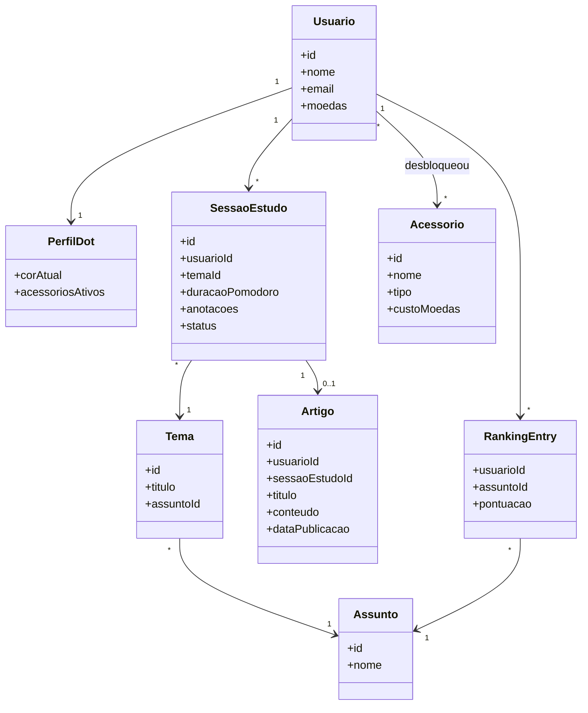
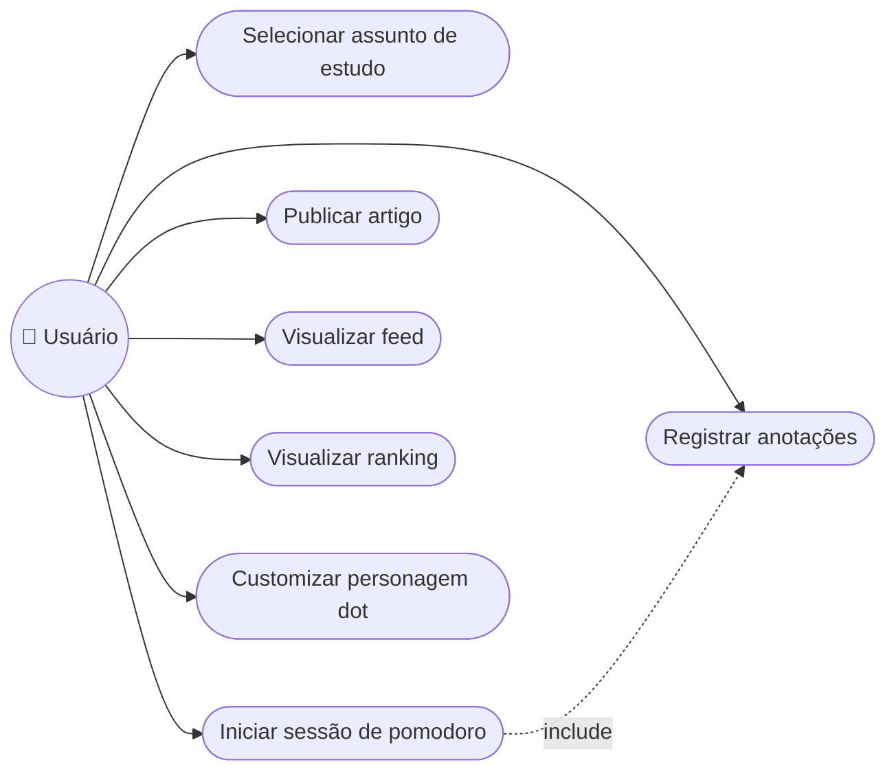

# dot.study — Design CP4 (Idealização)

**Data:** 2026-08-11
**Fase:** Checkpoint 4 — Idealização

## 1. Problema

Quem estuda sozinho — fora de uma sala de aula com rotina imposta — tem dificuldade em manter consistência e motivação. Não há com quem trocar o que foi aprendido, nem um sinal claro de progresso ao longo do tempo.

## 2. Persona

**Estudante autônomo.** Universitário, vestibulando ou profissional em transição de carreira, que estuda temas como tecnologia, marketing ou economia por conta própria (fora de um curso formal). Quer se manter motivado e visualizar sua evolução.

## 3. Proposta de valor

O dot.study transforma sessões de estudo solo em um ciclo com foco (pomodoro), registro (notas), compartilhamento (artigo) e recompensa (moedas + ranking). O estudo deixa de ser um esforço isolado e invisível.

## 4. Escopo

### Dentro do escopo (v1)

- Seleção de área de assunto (tecnologia, marketing, economia, etc.)
- Sugestão de temática aleatória dentro do assunto escolhido
- Sessão de estudo com pomodoro configurável + bloco de anotações
- Publicação de artigo a partir da sessão de estudo
- Feed com os artigos publicados pela comunidade
- Ranking de usuários por assunto
- Personagem "dot" customizável (cor, acessórios), com moedas ganhas por engajamento (pomodoro completo, artigo publicado)
- Dados mockados (sem persistência real) — protótipo funcional no CP5

### Fora do escopo (v1)

- Sistema de eventos (desafios temáticos, maratonas de estudo) — fica para versão futura
- Persistência real / autenticação real / API real — entra no CP6
- Apps nativos mobile — v1 é web app responsivo

## 5. Requisitos Funcionais (RF)

| # | Requisito |
|---|---|
| RF01 | O sistema deve permitir selecionar uma área de assunto |
| RF02 | O sistema deve sugerir uma temática aleatória dentro da área escolhida |
| RF03 | O sistema deve fornecer um timer pomodoro configurável (duração de foco/pausa) |
| RF04 | O sistema deve permitir registrar anotações durante a sessão de estudo |
| RF05 | O sistema deve permitir publicar um artigo com base na sessão de estudo |
| RF06 | O sistema deve exibir um feed com os artigos publicados pela comunidade |
| RF07 | O sistema deve calcular e exibir um ranking de usuários por assunto |
| RF08 | O sistema deve conceder moedas por ações de engajamento (pomodoro completo, artigo publicado) |
| RF09 | O sistema deve permitir customizar o personagem "dot" (cor, acessórios) usando moedas acumuladas |
| RF10 | O sistema deve exibir um perfil do usuário com progresso, moedas e personagem customizado |

> **Nota sobre pontuação/moedas:** tanto o ranking (RF07) quanto as moedas (RF08) são derivados do número de pomodoros completos e artigos publicados dentro de um assunto. A fórmula exata de conversão (quantas moedas por pomodoro, peso do artigo no ranking, etc.) é um detalhe de implementação a ser definido no CP5, quando o protótipo mockado entrar em construção.

## 6. Requisitos Não Funcionais (RNF)

| # | Requisito |
|---|---|
| RNF01 | Interface responsiva (desktop e mobile via navegador) |
| RNF02 | Telas principais devem carregar com fluidez perceptível (sem loaders longos) |
| RNF03 | Frontend organizado em componentes reutilizáveis (React), preparando evolução para CP5/CP6 |
| RNF04 | Dados mockados devem seguir um contrato de dados definido, para troca por API real no CP6 sem retrabalho de tela |
| RNF05 | Identidade visual (paleta, tipografia, mascote) aplicada de forma consistente entre todas as telas |
| RNF06 | Aplicação hospedada em serviço gratuito de deploy, acessível publicamente a partir do CP5 |

## 7. Stack tecnológica

React (frontend) + Node/Express (backend). Escolhida por: facilidade de mockar dados no CP5, trocar por API/banco real no CP6 sem reescrever telas, farta documentação, e deploy gratuito simples (Vercel para o frontend, Render/Railway para o backend).

## 8. Estrutura do repositório

```
dot-study/
├── README.md
├── docs/
│   ├── 01-problema-e-persona.md
│   ├── 02-requisitos.md        (RF/RNF — espelha as seções 5 e 6 deste documento)
│   ├── 03-escopo.md
│   ├── 04-modelagem-uml.md     (diagramas em Mermaid)
│   ├── 05-marca.md             (identidade visual)
│   ├── 06-pitch.md             (pitch + roteiro do vídeo)
│   └── 07-trello.md            (estrutura do quadro e backlog inicial)
├── frontend/.gitkeep
├── backend/.gitkeep
└── .gitignore
```

README.md traz: visão do projeto, problema resolvido, stack, equipe (nomes + RMs) e links para `docs/`.

**Equipe:**

| Nome | RM |
|---|---|
| Lucas Rodrigues Grecco | 558261 |
| Monique Ferreira dos Anjos | 558262 |
| Tiago Brito Nário | 558248 |
| Felipe Wapf Fettback | 557217 |
| Leonardo Tanaka Cortez | 556781 |
| Rafael Augusto Oliveira Silva | 555154 |

## 9. Modelagem UML

Diagramas em Mermaid, renderizados diretamente no GitHub (sem depender de ferramenta externa).

### 9.1 Diagrama de Classes



### 9.2 Diagrama de Caso de Uso

Mermaid não tem um tipo nativo para diagrama de caso de uso; representado como `flowchart` seguindo a convenção ator → elipses de caso de uso.



## 10. Identidade visual (marca)

- **Nome:** dot.study
- **Estilo:** Foco Minimalista
- **Paleta:**
  - Fundo: `#F7F7FA` (cinza-claro), branco puro para cards
  - Texto: `#111827` (quase-preto)
  - Acento primário: `#4F46E5` (índigo)
  - Acento secundário/neutro: `#9CA3AF` (cinza médio)
- **Tipografia:** sans-serif moderna (Inter ou Poppins) para títulos e corpo
- **Mascote "dot":** círculo simples com olhos grandes arredondados e bochechas rosadas (estilo "kawaii" discreto). Customizável por cor e por acessórios (chapéu de formatura, fones de ouvido, etc.), desbloqueados com moedas ganhas por engajamento — sem afetar a jogabilidade, só cosmético.

## 11. Pitch (rascunho)

> "Você já estudou sozinho, terminou uma sessão inteira de pomodoro e, no final, teve a sensação de que aquele conhecimento simplesmente evaporou? O dot.study resolve isso. Transformamos cada sessão de estudo solo numa jornada com foco, registro e recompensa: você escolhe um assunto, recebe um tema, usa nosso pomodoro integrado, anota o que aprendeu e publica um artigo pra comunidade. A cada sessão completa, você ganha moedas pra customizar seu personagem — o dot — e sobe no ranking do seu assunto. Diferente de um app de produtividade genérico, o dot.study é feito pra quem estuda por conta própria e precisa de motivação de verdade: social, visual e gamificada. A gente não vende um timer. A gente vende o hábito de estudar."

**Diferencial:** combina foco (pomodoro), compartilhamento de conhecimento (artigos) e gamificação social (ranking + customização) num único ciclo — a maioria dos apps de estudo resolve só uma dessas partes isoladamente.

## 12. Roteiro do vídeo de apresentação (2 min)

1. Problema (20s) — a dor de estudar sozinho sem motivação nem registro de progresso
2. Solução/fluxo (40s) — demonstrar o ciclo: assunto → tema → pomodoro → notas → artigo
3. Diferencial (30s) — gamificação (moedas, personagem, ranking) e comunidade (feed)
4. Fechamento (20s) — chamada para ação / próximos passos do projeto

## 13. Trello

Colunas mínimas: **Backlog / To Do / Doing / Done**.

Backlog inicial por frente de trabalho (a ser distribuído entre os 6 integrantes do grupo pelo próprio time):

- **Documentação:** escrever problema/persona, RF/RNF, escopo
- **Modelagem UML:** diagrama de classes, diagrama de caso de uso
- **Marca:** identidade visual (paleta, tipografia, mascote) formalizada em Figma
- **Pitch/Vídeo:** roteiro, gravação e edição do vídeo de 2 min
- **GitHub:** estrutura de pastas, README, organização do repositório
- **Trello:** montar e manter o quadro atualizado durante o checkpoint

## 14. Fora deste documento

- Conteúdo detalhado de cada arquivo em `docs/` (será gerado na fase de implementação, com base neste design)
- Configuração real do quadro Trello (feita pelo grupo, fora do repositório)
- Formalização do logo/paleta em Figma (este documento define a direção; a peça final em Figma é produzida pelo grupo)
